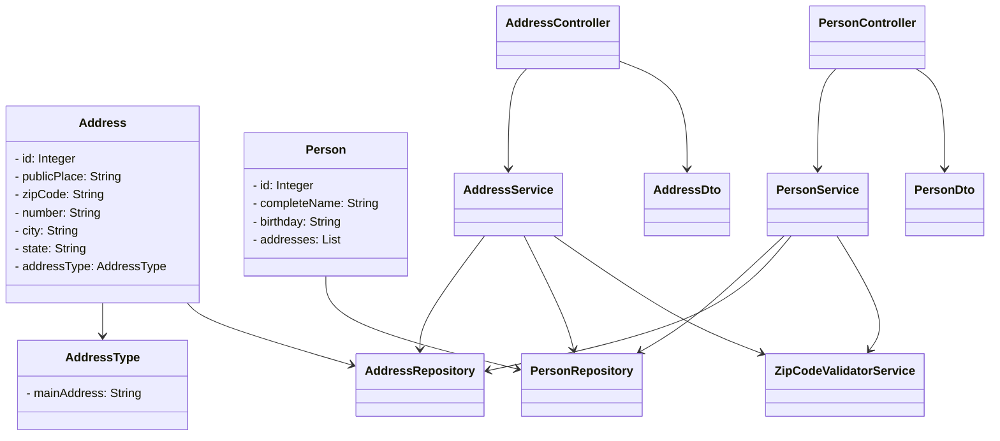

# Person API
Java RESTful API para cadastro de Pessoas e Endereços

**Tecnologias usadas**

* [**`Java 17`**](https://www.oracle.com/java/technologies/javase/jdk17-archive-downloads.html)
* [**`Spring Boot 3`**](https://spring.io/projects/spring-boot)
* [**`Spring Data JPA`**](https://docs.oracle.com/javaee/7/api/javax/persistence/package-summary.html)
* [**`RestTemplate`**](https://docs.spring.io/spring-framework/docs/current/javadoc-api/org/springframework/web/client/RestTemplate.html)
* [**`H2 Database`**](https://www.h2database.com/html/main.html)
* [**`PostgreSQL`**](https://www.postgresql.org/)
* [**`Mockito `**](https://site.mockito.org/)
* [**`Flyway `**](https://flywaydb.org/)
* [**`Lombok `**](https://projectlombok.org/)
* [**`Swagger `**](https://swagger.io/)
* [**`Docker `**](https://www.docker.com/)

### Use comando maven `\mvn clean install` dentro do diretorio do projeto para buildar o .jar, depois inice o docker-compose com comando `docker-compose up`
[**`Swagger UI`**](http://localhost:8080/swagger-ui/index.html)
